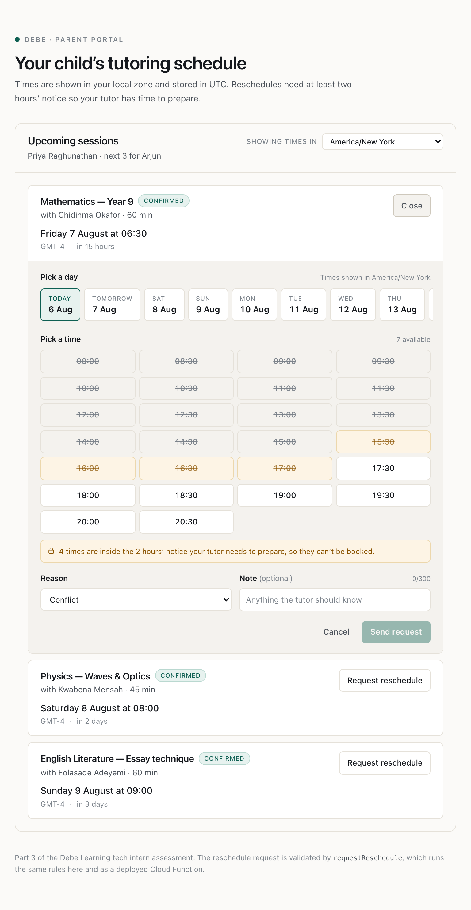
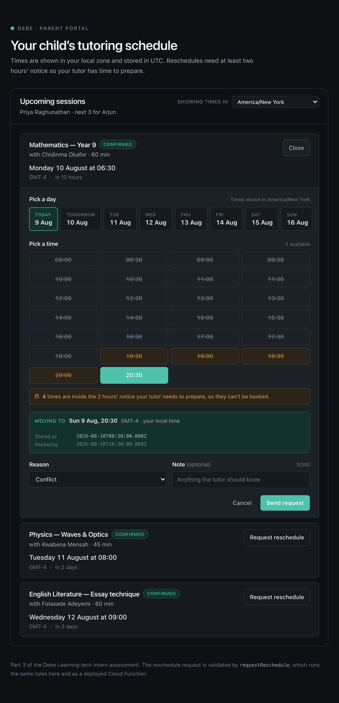
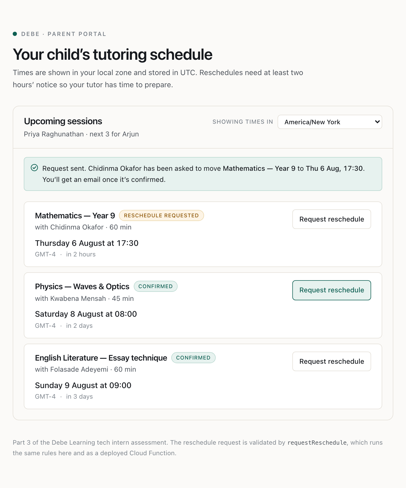
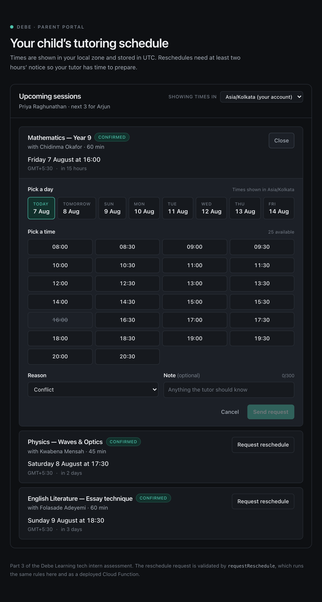
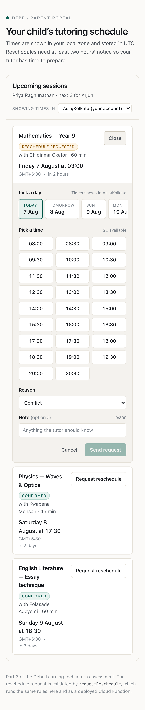

# Debe Learning — Tech Intern Assessment

**Garv Bahl** · [github.com/garvbahl37-gif](https://github.com/garvbahl37-gif) · garvbahl37@gmail.com

| Part | Where |
|---|---|
| 1 — Portfolio walkthrough | [below](#part-1--github-portfolio-walkthrough) |
| 2 — Debugging round | [`part2-debug/`](part2-debug/) · [write-up](part2-debug/README.md) |
| 3 — Reschedule widget | [`part3-widget/`](part3-widget/) · [write-up](part3-widget/README.md) |
| 4 — Explain-it-yourself video | [link below](#part-4--explain-it-yourself-video) |

---

# Part 1 — GitHub Portfolio Walkthrough

**Profile:** https://github.com/garvbahl37-gif

## 1. LoadFlow — freight brokerage operations, with a compliance gate

**Repo:** https://github.com/garvbahl37-gif/LoadFlow · **Live:** https://loadflow-garvbahl37-gifs-projects.vercel.app (every password is `loadflow`)

### The problem it solves

A freight broker sits between shippers who have goods to move and carriers who move them. It is a business built on liability: if a broker dispatches freight to a carrier whose insurance has lapsed or whose operating authority has been revoked, the broker is legally on the hook. In practice that failure doesn't happen because someone is reckless — it happens because a dispatcher under pressure doesn't check a date on a certificate.

LoadFlow makes that mistake impossible to make by accident. The moment a carrier is assigned to a load, its compliance record is evaluated against seven rules, and a load with an open blocking flag **cannot move past `Carrier Assigned`** — not from the UI, not from `curl`, and not for an administrator holding every permission in the system. Everything else in the app exists to make that one guarantee credible.

### What I built

Solo project, all of it. The parts I'd point at:

- **A real permission system, not three hardcoded roles.** Roles are admin-authored bundles assembled at runtime from a fixed catalogue of ten permissions. Their *names are meaningless to the code* — every decision is `can(session, "load.assign_carrier")`, never `if (role.name === "Ops Lead")`. There is a test that greps the whole source tree and **fails the build** if any conditional branches on a role name, because that is the rule that quietly erodes first.
- **Three independent layers of access control**, all server-side: authentication (a database-backed session, so revoking a user takes effect on their next request rather than whenever a token expires), permission (including an org-type lock, so a carrier can never hold `load.create` even if a row were forged), and scope, `AND`ed into every query. A permission can widen what you may *do*; it can never widen what you may *see*. Out-of-scope reads return **404, not 403** — never confirm the existence of a record someone may not see.
- **A ten-state load lifecycle as a declarative state machine** — a table of `(from, to, permission, actor, guards)`. Nothing in the codebase can change a load's status except through it, which is what makes the compliance gate unbypassable rather than merely present in the happy path.
- **Versioned, immutable rate confirmations.** v2 supersedes v1; v1 is never edited. The load remembers the version actually agreed and freezes it at dispatch, so a load closed months ago still shows the rate it closed on.
- **Verification, not assertion**: 29 unit tests on the permission engine, state machine and compliance rules, plus a 24-assertion proof that attacks the REST API directly over HTTP with no UI involved, plus a full-lifecycle drive that pushes a fresh load through all ten states as the correct personas.

### One design decision I'd make differently today

**I re-evaluate compliance synchronously, inside the request that triggered it.**

When a carrier's insurance is renewed, the evaluator re-runs across *every live load for that carrier* and clears the flags automatically. It's the most satisfying moment in the product — "Insurance renewed — 1 load unblocked" — and I built it inline because that immediacy was the point.

The cost is that the latency of a single `PATCH` on a compliance record scales with how many loads that carrier is currently holding. With the seeded demo world it's three loads and nobody notices. With a real carrier holding four hundred, that request is doing four hundred rule evaluations and writes while an ops user watches a spinner — and if it times out halfway, some flags are cleared and some aren't, because I never put a transaction boundary around the fan-out.

Today I'd make the renewal write one thing — the compliance record — and emit an event. A queued worker would do the fan-out, idempotently, one load at a time, with the UI reflecting it as it lands. The user-visible immediacy I wanted is achievable with an optimistic update; what I actually built was a request whose cost is unbounded by anything the user can see. The tell was there in the code and I read it as "fast enough" rather than "unbounded".

---

## 2. HireLens — resume review that tells you *why* you were rejected

**Repo:** https://github.com/garvbahl37-gif/HireLens · **Live:** https://hire-lens-tawny.vercel.app (`demo@hirelens.app` / `demo1234`)

### The problem it solves

Applicants get rejected by ATS filters and recruiter skims without ever learning what went wrong, so they iterate blindly — rewriting the wrong things and applying again. HireLens takes a resume and the specific job description being targeted and returns a scored, recruiter-grade review: an overall score, five scored dimensions, the ATS keywords that are missing, section-by-section grades, and a prioritised fix list. Paid users additionally get line-by-line rewrites of their weakest bullets and the interview questions their gaps will trigger.

The demo account is preloaded with two real reviews of the *same* resume against the *same* posting: 62/100, then 92/100 after its own feedback was applied. That's not seed data invented to look good — it's the product's actual output, and the landing page's proof section is built from it.

### What I built

Solo project, all of it: the marketing landing page, auth, the analysis pipeline, persistence, the billing loop, the dashboard, and a Chrome extension that scores any job page against your resume in one click.

The parts I'd point at:

- **The payment loop is the real one.** The success redirect is cosmetic. Nothing upgrades an account except the `checkout.session.completed` webhook handler writing `plan = PRO` to our database. Every Stripe event id is inserted into a `StripeEvent` table first, so a redelivered event cannot be applied twice — webhooks are at-least-once, and the idempotency table is the difference between that being fine and being a double-charge.
- **Plan gating is enforced server-side**, not by hiding UI. The free tier is hard-capped at three reviews a month and the deep-analysis sections are *never generated* for free users — so the paywall costs us nothing to enforce and can't be lifted by editing the client.
- **Schema-validated LLM output.** The analysis is parsed against a schema before it is persisted or rendered, so a model that returns prose instead of JSON produces a handled error rather than a dashboard full of `undefined`.
- **Session auth done deliberately**: bcrypt hashes, a signed JWT in an httpOnly cookie, verified at the edge without a database round trip on every `/dashboard/**` request.

### One design decision I'd make differently today

**I stored the entire analysis as an unversioned `Json` blob on the `Review` row.**

`result Json` holds the whole validated analysis, with `overallScore` and `verdict` promoted to real columns beside it. At the time that felt obviously right: the shape was still moving weekly, and a blob meant I could add a scored dimension without a migration.

Two problems showed up. The first is that anything I want to ask *across* reviews — "how do scores move after a re-run", "which ATS keywords are missed most often" — is either a full table scan in application code or a JSON operator query against a shape nothing guarantees. The second is worse: I changed the analysis shape several times, and there is nothing on the row saying which shape it is. Old reviews and new reviews are structurally different objects in the same column, and the only thing stopping the results page from crashing on a two-month-old review is that the renderer happens to be defensive.

Today I'd keep the blob — it *is* the right place for the long-form prose — but add a `resultVersion` column written on every insert, and promote the handful of fields I actually query into real columns at write time. A blob you can't version is a blob you can't safely evolve, and I learned that by writing a migration script to backfill rows I couldn't reliably identify.

---

## On commit history

You said you'd look at this, so I'd rather raise it than have you find it.

**HireLens** is 30 commits over about two and a half weeks (12, 13, 15 and 29 July), which is a fair picture of how I actually work: a heavy initial build, then returning to it.

**LoadFlow is 63 commits in a single day**, and that is real — it was a timed take-home and I built it in one long sitting. I'm not going to dress that up as anything else. What I'd point at instead is what the messages say, because that's the part I do care about:

```
fix(security): stop GET /api/loads/[id] leaking broker-staff password hashes
fix(scoping): shippers no longer see the broker-carrier rate negotiation via the API
fix(compliance): an override for one carrier no longer suppresses the flag for another
fix: a fresh clone failed on the reviewer's very first command
```

Each of those is one defect, named by its effect rather than its diff. That run of `fix(scoping)` commits is me attacking my own API with `curl` after the feature "worked", and finding four ways it didn't.

The repo in front of you now is the same habit: I've committed in stages, and the messages say why rather than what. Commit `d80376f` is a bug I only found by opening the widget at 23:00 and seeing a screen the tests were never going to catch.

---

# Part 2 — Debugging Round

📁 [`part2-debug/original.ts`](part2-debug/original.ts) (verbatim) · [`part2-debug/fixed.ts`](part2-debug/fixed.ts) (fixed) · [full write-up](part2-debug/README.md)

Four distinct bugs, one from each category named in the brief, plus a fifth supporting issue that would have kept the slot guard broken even after the other four were fixed.

| # | Category | What's wrong | Why it matters in production |
|---|---|---|---|
| 1 | **async/await** | `.get()` is never awaited, so `existing` is a `Promise` and `existing.docs` is `undefined`. Separately, the final `.add()` is fire-and-forget. | The function had a **100% error rate** — it never worked once, for anybody. The unawaited write is the nastier half: Cloud Functions freezes the container's CPU when the handler returns, so the booking can silently never land while the client is told `{ success: true }`. It passes locally, because the emulator keeps the process alive. |
| 2 | **security** | `context` is never inspected, and `studentId` is read straight out of the request body. | A deployed callable is a **public internet endpoint**, and the Admin SDK **bypasses Firestore Security Rules entirely** — this is an unauthenticated write into a billed database. Even with an auth check added, trusting `studentId` from the body lets any signed-in parent book in another family's name (IDOR). |
| 3 | **logic** | The conflict check queries the `teachers/{id}/bookings` **subcollection**; the write goes to the **top-level** `bookings` collection. | Two unrelated collections. The guard reads one nothing ever writes to, so it is always empty and can never fire — every teacher can be booked into the same slot without limit. It *reads* as correct, which is why it survives review. Compounded by a read-then-write race: two parents tapping "Book" within the same few hundred ms both see zero conflicts and both write. |
| 4 | **typing** | `data: BookingRequest` is an unchecked assertion over untrusted network input. | TypeScript erases at runtime. `{}` produces a document full of `undefined`, which the Firestore Node SDK **rejects** — so the caller gets an opaque `INTERNAL` 500 instead of a useful validation message. |
| 5 | *(supporting)* | Slots are compared with Firestore `==`, a **raw string** comparison. | `…T14:00:00Z`, `…T14:00:00.000Z` and `…T19:30:00+05:30` are one instant serialised three ways. Different clients serialise differently, so the duplicate guard leaks double-bookings even when pointed at the right collection. |

### The root cause behind bug 1 is a process gap, not a typo

`tsc` catches it. That says something more useful than the bug does: this was committed without a typecheck in CI. One bug is a mistake; shipping a bug the compiler already found is a gap in how the code gets merged.

`npm run prove-bugs` demonstrates that rather than asking you to take it on trust:

```bash
cd part2-debug && npm install && npm run prove-bugs
```

```
→ Claim 1: original.ts must FAIL to type-check
  ✓ tsc rejected it, as expected:
      original.ts(35,16): error TS2339: Property 'docs' does not exist on
        type 'Promise<QuerySnapshot<DocumentData, DocumentData>>'.
→ Claim 2: fixed.ts must type-check cleanly
  ✓ fixed.ts compiles under strict mode.
Both claims hold.
```

It also surfaced a bonus find: on `firebase-functions` v6 the bare `from "firebase-functions"` import now resolves to the **v2** API, whose handler takes a single `CallableRequest` rather than `(data, context)`. `fixed.ts` imports from `firebase-functions/v1` explicitly so a routine `npm update` can't silently change the contract.

### What the fix does

`async` throughout with every promise awaited; `context.auth` required and **`studentId` derived from `context.auth.uid`**; runtime validation narrowing `unknown` at the trust boundary; the check and the write moved into one collection inside `db.runTransaction`, which closes the race as well as the logic bug; slots canonicalised to UTC; `createdAt` via `serverTimestamp()` rather than the container's clock; and `HttpsError` for exceptional cases with a typed `{ success: false }` for the expected outcome of a taken slot — with internal Firestore error strings logged rather than returned, since they carry document paths.

---

# Part 3 — Session Reschedule Widget

📁 [`part3-widget/`](part3-widget/) · [full write-up](part3-widget/README.md)

```bash
cd part3-widget
npm install
npm run dev        # http://localhost:3000
npm run verify     # typecheck × 3 workspaces + lint + 90 tests
```

No Firebase project, no API keys, no `.env`.




*The lock-out, viewed in `America/New_York` where it is currently mid-afternoon — so the amber band is real, not staged with a faked clock. Grey = already passed, **amber** = inside the two-hour window, white = bookable.*



*The local/UTC split made visible: `17:30 GMT-4` is what the parent picked, `2026-08-06T21:30:00.000Z` is what gets stored. Change the zone and the top line moves while `Stored as` holds.*

<details>
<summary>Request sent · dark mode · 390px</summary>





</details>

### Structure

Three npm workspaces, not one app:

```
shared/      @debe/shared — imported by BOTH web and functions
functions/   the real firebase-functions v2 onCall
web/         Next.js App Router
tests/       90 tests, no emulator
```

The brief asks for shared types between the frontend and the function. Two files that agree today will disagree eventually, so `@debe/shared` is a real package boundary both import — the contract cannot drift without the compiler noticing.

`createRescheduleHandler(deps)` takes a repository and a clock and knows nothing about HTTP. The Cloud Function wraps it in `onCall`; the local Next route handler wraps it in a `POST` that speaks the **Firebase callable wire protocol** (`{ data }` in, `{ result }` or `{ error: { status, message } }` out). So pointing the app at a deployed function or the emulator is one environment variable and no calling-code change.

### The local/UTC decision

**Instants are stored; wall clocks are rendered.** A session has `startsAtUtc` and no timezone field. It doesn't happen "at 3pm" — it happens at an instant, and the parent, the student and the tutor may each view that instant from a different zone.

**The two kinds of string are different types.** `UtcIsoString` and `LocalWallClock` are both `string` at runtime but distinct to the compiler. `<input type="datetime-local">` hands you `"2026-08-08T15:00"` — a wall clock with no zone — and `new Date()` on that parses it in the *runtime's* zone, which is UTC on a server and something else on a laptop. The booking then lands hours off, but only for users outside the server's zone, so it survives every test you run at your desk. The brands make `wallClockToUtc()` the only way across.

**The server renders in the account's zone, not the browser's.** Reading the device zone during render is a hydration bug — the server can't know it, so the two renders disagree and React discards the server HTML, silently, in production. So `ParentProfile.timeZone` is authoritative for the first paint; the device zone is detected after mount and used only to *offer* a switch. That's also better product behaviour: a parent travelling for a week hasn't moved their child's lessons.

**DST is handled, not assumed.** On the day New York springs forward, 02:30 never happens; on the day it falls back, 01:30 happens twice. `wallClockToUtc` samples the offset a day either side, keeps the candidates that round-trip, and returns `exact | dst-gap | dst-ambiguous` rather than silently picking one. Slots are generated by iterating the **wall clock** and converting each reading independently, so gap readings are dropped and the day simply has fewer slots. The test that pins this hardest: zero slots for `2011-12-30` in `Pacific/Apia`, the day Samoa skipped crossing the date line.

The form prints the instant it's about to store beneath the local time it's showing — `Stored as 2026-08-08T09:00:00.000Z`. Two hours of my life have gone to someone insisting they booked 3pm while the database said 09:30Z, both of them right.

### The 2-hour lock-out

`RESCHEDULE_LEAD_TIME_MS` lives in `shared/src/policy.ts` and is imported by both sides. If the UI greyed out on 2 hours while the server enforced 90 minutes, the app would offer a slot and then refuse it.

The picker is a **discrete slot grid, not `<input type="datetime-local">`** — deliberately. A native datetime input can't express "these particular times are unavailable"; `min` gives a floor and nothing else, and that `min` is a wall-clock string with no zone, compared in the device's local terms. You cannot express "two hours from now, in UTC" to that attribute at all.

Locked slots say *why* — in the tooltip, the `aria-label`, and a banner ("4 times are inside the 2 hours' notice your tutor needs to prepare"). The client check is a courtesy that saves a round trip; the server runs the identical function against **its own clock**, because a browser with a wrong system clock greys nothing out. A 60-second skew grace only ever *admits* a borderline slot, so tapping the instant one becomes legal isn't punished by 300 ms of latency. `useNow()` re-reads every 30 s, so a slot ages into the window and greys itself out while the form is open.

### No `any`, no unhandled rejections

`@typescript-eslint/no-explicit-any` is set to `error` — enforced, not asserted. The one place it'd be tempting, the request body, is `unknown` narrowed by a real guard.

`callRequestReschedule` has **no rejecting path**: offline, DNS failure, timeout, protocol error, and a 200 with the wrong shape all become typed `{ success: false }`. "No unhandled promise rejections" is then a property of the code — no caller can forget a `.catch`, because there is nothing to catch. `'never rejects, whatever it is given'` is a test.

### Verification

90 tests, no emulator. The ones that carry weight:

| Test | What it defends |
|---|---|
| `gives the same reading two different instants in summer and winter` | 3pm in London is 15:00Z in January, 14:00Z in July |
| `returns nothing for a calendar day that never happened` | Samoa, 30 Dec 2011 |
| `enforces lead time against the SERVER clock, not the client's` | the browser's clock is not evidence |
| `gives the same answer for someone else's session as for one that does not exist` | the endpoint can't be used to enumerate ids |
| `will not let one parent touch another family's session` | IDOR — the descendant of Part 2's bug 2 |
| `never rejects, whatever it is given` | why the UI has no try/catch |

Also driven end-to-end in Chromium at two clocks — 23:00 (day exhausted → empty state and jump-to-next-opening work) and 10:30 pinned (four slots amber-locked, boundary exactly at now + 2 h) — with no console errors and no hydration warning, browser in `Europe/London` against an account in `Asia/Kolkata`.

### What I left out, and why

- **Tutor availability isn't modelled** — every 30-minute slot 08:00–21:00 is offered. A real portal intersects the tutor's roster; the generator already returns instants, so that's a filter, not a rewrite.
- **The repository is in-memory.** Swapping it for Firestore means implementing one interface, and the write should be a transaction for exactly the reason Part 2 needed one.
- **`reschedule_requested` has no tutor-side accept/decline.** The status exists and sessions move to it; nothing consumes it yet.
- **No component tests.** Logic is covered thoroughly and the UI was driven in a real browser, but there's no Testing Library suite in CI.
- **`enforceAppCheck` is off**, because this build has no App Check provider configured. One word, and it belongs on for a public parent portal.

---

# Part 4 — Explain-It-Yourself Video

🎥 **Watch (4 min 23 s):** `[ PASTE GOOGLE DRIVE LINK HERE ]`

A screen recording of the Part 3 code, covering:

1. A walk through the Part 3 code — the workspace split, `@debe/shared`, and the one-handler-two-transports arrangement.
2. The local-time/UTC decision: why sessions store an instant and never a wall clock, why the branded types exist, and why the server renders in the account's zone rather than the browser's.
3. The 2-hour lock-out: where the constant lives, why both sides import it, and why the server re-checks against its own clock.
4. **Breaking it on camera** — short-circuiting `wallClockToUtc` so a wall-clock reading is stored as though it were already UTC. The slot grid visibly shifts to 13:30 → 02:00, a Kolkata parent's booking lands 5½ hours out, and **37 of 90 tests go red** — every one of them touching the conversion, while all 27 authorisation and validation tests still pass.

See [`part3-widget/README.md`](part3-widget/README.md) for the same reasoning in writing.
